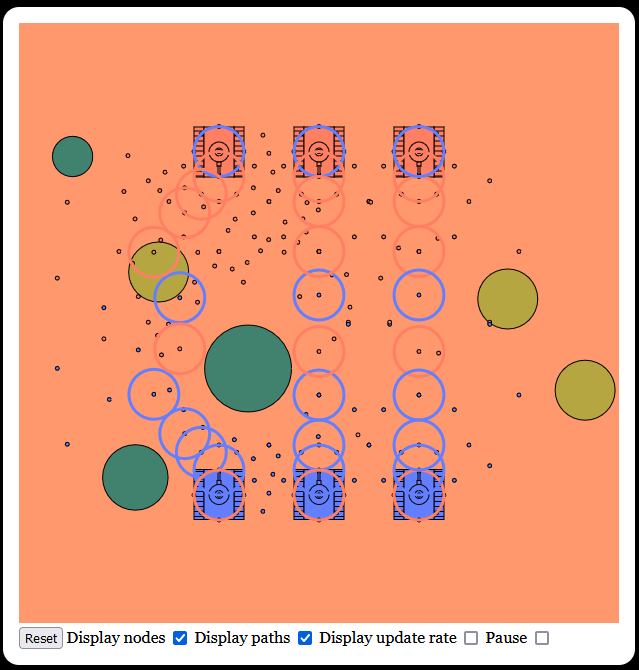

# Mars

[![MIT licensed][mit-badge]][mit-url]

[mit-badge]: https://img.shields.io/badge/license-MIT-blue.svg
[mit-url]: https://github.com/david-wallace-croft/com-croftsoft-app-mars/blob/main/LICENSE.txt

- Tank combat game using the A* algorithm
- You can see the Rust code compiled to WebAssembly and running in the browser
  - https://www.gamespawn.com/arcade/mars/

## Update 2025-04-06

- I had to revert npm to version 8.19.4 to get this to work again
- I also reverted Node.js to version 17.9.1 but that might not be relevant
- See https://github.com/parrotmac/rust-wasm-hello-world

## Usage

- cd com-croftsoft-app-mars/
- npm install
- npm start

## History

- Initial release: 2023-03-10
